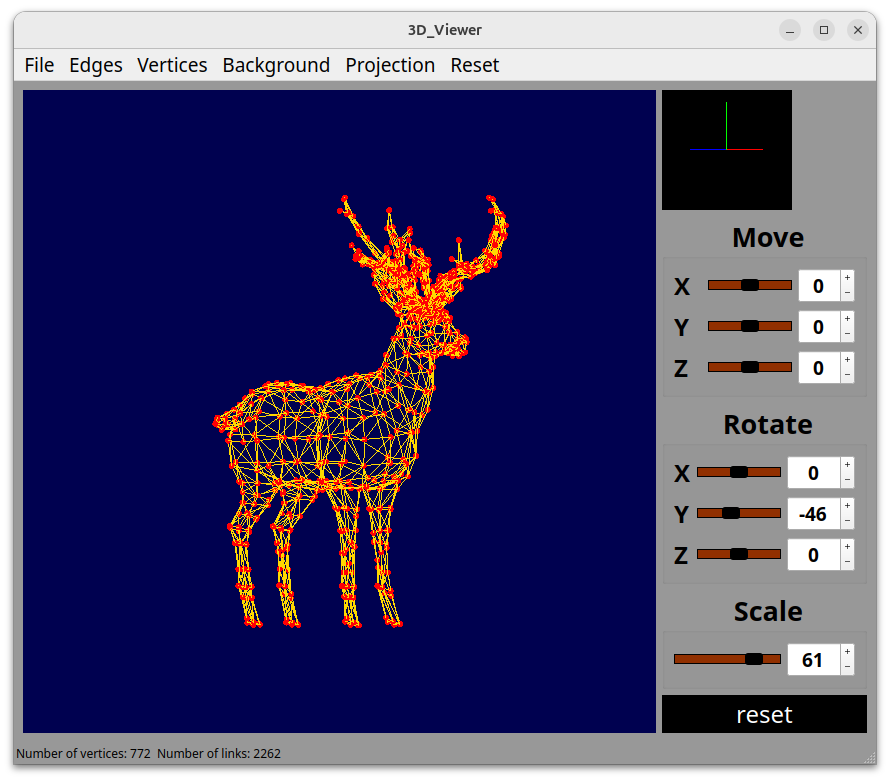

# 3DViewer

## Main part

This is a program for visualizing 3D wireframe models.

A few words about the project:
- The program is developed in C++ language of C++17 standard
- Code style - Google style for C++ https://google.github.io/styleguide/cppguide.html
- Makefile targets: all, install, uninstall, clean, dvi, dist, tests
- There is full coverage of expression calculation modules with unit-tests using the GTest library
- The program provides the ability to:
  - Load a wireframe model from an obj file (vertices and surfaces list support only).
  - Translate the model by a given distance in relation to the X, Y, Z axes.
  - Rotate the model by a given angle in relation to its X, Y, Z axes.
  - Scale the model by a given value.
- The GUI implementation is based on QT
- The program correctly processes and allows user to view models with details up to 1,000,000 vertices without freezing
- 3 design patterns wered used -  facade, singleton, mediator
- You can configure:
  - the type of projection (parallel and central)
  - the type (solid, dashed), color and thickness of the edges
  - display method (none, circle, square), color and size of the vertices
  - background color
- The settings are saved between restarts of the program
- The program saves the captured (rendered) image in bmp and jpeg formats.
- The program can save the captured (rendered) images as bmp and jpeg files.
- The program can record small screencasts - the current custom affine transformation of the loaded object into gif-animation (640x480, 10fps, 5s)

## Installation

1. Clone this repo `git clone git@github.com:DimDrag/3D_Viewer_2.0.git`
2. Make the installation script executable and run `sudo chmod +x install.sh && sudo install.sh`
